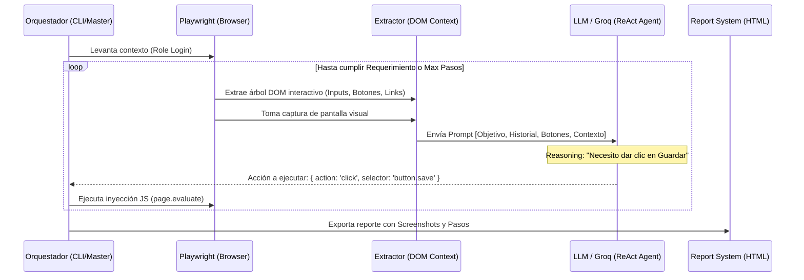

# QA Surface Tester: Plataforma Autónoma de Verificación ReAct

Bienvenido a la documentación técnica y comercial del **QA Surface Tester**, una solución de pruebas de nueva generación diseñada para emular el comportamiento humano sobre interfaces web complejas.

Este documento está elaborado especialmente para arquitectos de software e ingeniería de TI. Su objetivo es proporcionar una vista a 10.000 pies de altura (y a nivel de código) sobre nuestra innovadora aproximación al QA usando **Modelos de Lenguaje Grandes (LLMs)** mediante el paradigma **ReAct (Reasoning + Acting)**.

---

## 1. Visión Ejecutiva (El "Pitch" para Ventas/TI)

Los enfoques tradicionales de QA automatizado (Selenium, Cypress puro, Playwright clásico) dependen de selectores estáticos, flujos rígidos ("happy paths") y mantenimiento constante de scripts. Cuando la UI cambia, los tests se rompen.

El **QA Surface Tester** cambia el paradigma: le damos a un agente autónomo de IA (potenciado por **Groq** y visión artificial) un "rol" (ej. *Abogado Titular*, *Cliente*, *Super Admin*) y una "misión" en lenguaje natural (ej. *"Abre el expediente más reciente y descarga el PDF"*). El agente utiliza **Playwright** como su motor sensorial y motor motriz:
1. **Observa** el DOM y las capturas de pantalla.
2. **Razona** sobre qué elemento interactivo le sirve para cumplir su misión.
3. **Actúa** inyectando eventos (clicks, fill) directamente en el navegador.

**Ventajas clave:**
* **Cero mantenimiento de rutas rígidas:** Si cambias de lugar un botón pero este sigue siendo semánticamente claro, el bot lo encontrará.
* **Cobertura multi-rol automática:** Iteración orquestada donde el bot asume distintas identidades, limpiando el contexto entre sesiones.
* **Tolerancia a fallos por asincronía:** El bot "ve" cuando una pantalla está cargando (skeletons) y razona que debe esperar, sin necesidad de comandos rígidos de `waitForTimeout`.

---

## 2. Arquitectura del Sistema (Diagramas)

La arquitectura sigue un modelo de inyección de contexto acoplado a un motor de inferencia rápido. A continuación, el flujo de vida de una ejecución de prueba:



### Componentes Principales

1. **El Orquestador (`master_verification_agent.js` / `InteractiveTestRunner.js`)**
   Coordina las misiones. Toma el archivo de definición de pruebas (ej. `QA_master.md`) y lanza las instancias de Chromium. Aisla las sesiones para garantizar la veracidad de la prueba.
2. **El Extractor DOM (`pageContext`)**
   No enviamos todo el HTML al LLM (eso agotaría la ventana de contexto y generaría ruido). Ejecutamos un script en la página que extrae únicamente elementos semánticamente interactivos: `button`, `a`, `input`, `select`, y elementos con clases específicas como `.btn` o atributos de accesibilidad como `role="button"`.
3. **El Cerebro (Groq SDK)**
   Usamos la inferencia ultra-rápida de Groq para tomar decisiones en fracciones de segundo, permitiendo que la navegación de la prueba no tenga cuellos de botella por parte de la IA.

---

## 3. Guía para Extensión y Mejora (Developer Point of View)

Para el equipo de arquitectura, este repositorio (`qa-surface-tester`) está diseñado para ser altamente modular. Aquí hay 3 áreas principales de oportunidad para seguir mejorando y escalando la plataforma:

### A. Mejorar la "Visión" del Agente
Actualmente el Extractor DOM utiliza un filtro rudimentario pero efectivo:
```javascript
// Filtro actual en InteractiveTestRunner.js
const buttons = Array.from(document.querySelectorAll('button, .btn, a, [role="button"]'))
```
**Oportunidad de Mejora:** Puedes inyectar librerías de accesibilidad (como `axe-core`) dentro del contexto de Playwright para extraer el *Accessibility Tree* nativo del navegador, proporcionándole al LLM una representación estructural mucho más parecida a lo que "ve" un lector de pantallas, elevando radicalmente la resiliencia del bot a componentes complejos como modales o selects custom (headless UI).

### B. Múltiples Agentes (Swarm QA)
Al escalar, se puede implementar un patrón *Actor* donde múltiples navegadores de Playwright ejecutan requerimientos en paralelo usando `Worker Threads` de Node.js, reduciendo el tiempo total de la suite de pruebas a unos pocos minutos, independiente del volumen del sistema bajo prueba.

### C. Auto-Sanación de Endpoints
Si el agente no puede continuar debido a que una API falla o un mock no está presente, puede estar autorizado a comunicarse con un agente secundario o un endpoint administrativo para generar dinámicamente los datos (ej. sembrar la BD temporalmente) y poder continuar la validación de la interfaz.

---

## 4. Conclusión para el Partnership Tecnológico

El **QA Surface Tester** no es solo una herramienta, es un *framework de calidad cognitiva*. Transforma los requerimientos de negocio (`QA_master.md`) directamente en validaciones técnicas iterativas sin escribir código intermedio por cada prueba.

Al adoptar esta arquitectura, el equipo reduce a cero el mantenimiento de suites *End-to-End* frágiles, asegurando entregas continuas (*Continuous Delivery*) ágiles y a prueba de regresiones visuales o de experiencia de usuario.

---

## 5. Prompt de Despliegue (Agent-to-Agent Handoff)

Si deseas que otro agente de IA (como un Claude, GPT-4 o Gemini) construya o replique esta arquitectura base en un nuevo proyecto o sistema, puedes proporcionarle el siguiente "Meta-Prompt". Este texto contiene la esencia técnica necesaria para inicializar el framework:

```text
Actúa como un Arquitecto de Software y Especialista en QA Automatizado. Tu objetivo es construir un "QA Surface Tester" autónomo desde cero utilizando Node.js, Playwright y un modelo de lenguaje (LLM) rápido (como Groq, OpenAI o Claude). 

Deberás implementar un sistema que siga el paradigma ReAct (Reasoning + Acting) para testear una interfaz web. Los requisitos fundamentales que debes programar son:

1. ORQUESTADOR (Playwright): Un script maestro en Node.js que levante Chromium, inicie sesión o asuma un "Rol" y reciba una misión o "Requerimiento Funcional" en lenguaje natural.
2. EXTRACTOR DE CONTEXTO: Una función inyectada en el navegador (`page.evaluate`) que raspe el DOM en busca de elementos interactivos (a, button, input, select, .btn, [role="button"]) y extraiga su texto, placeholders y un selector CSS único. No devuelvas todo el HTML, solo la matriz de elementos útiles.
3. CICLO ReAct (Bucle Principal): 
   - Toma el arreglo de elementos extraídos.
   - Envíaselos al LLM junto con el objetivo y el historial de acciones recientes.
   - El LLM debe responder obligatoriamente con un JSON estructurado con el formato: { "action": "click|fill|verify|stop", "selector": "el_selector_css", "value": "texto_a_escribir", "reasoning": "Por qué tomo esta decisión" }.
   - Ejecuta la acción en Playwright (ej. `page.click(selector)`).
   - Repite el ciclo hasta que el LLM devuelva la acción "stop" indicando éxito o fracaso irremediable.
4. RESILIENCIA: Implementa capturas de pantalla automáticas (screenshots) en cada paso para un reporte final.

Crea los archivos iniciales, el package.json con las dependencias necesarias y el script principal de ejecución para tener un prototipo funcional.
```

### Capacidad de Auto-Reparación y Caché de Sesiones (AI Auto-Repair)
Para eficientar el consumo de tokens y maximizar la robustez del testing:
1. **Reutilización de Contexto de Autenticación:** Se implementó una lógica de `storageState` en Playwright. Cuando un escenario inicia sesión exitosamente, se guarda el archivo `auth_{Rol}.json`. Si futuros escenarios requieren el mismo rol, el `BddAiRunner` inyecta la cookie de sesión de inmediato, omitiendo el renderizado del formulario de inicio de sesión y saltando directamente al estado de completado.
2. **Auto-Reparación de Selectores (Self-Healing):** En lugar de fallar inmediatamente ante un cambio de DOM (e.g., *Timeout* al hacer click en un botón que cambió de texto), el motor captura la excepción e inserta un registro en el historial de acciones (`actionHistory.push({ error: ... })`). Esto permite al modelo iterar dinámicamente y probar un selector secundario (placeholder, nth-child, etc.) en tiempo real, garantizando la continuidad de la prueba.
